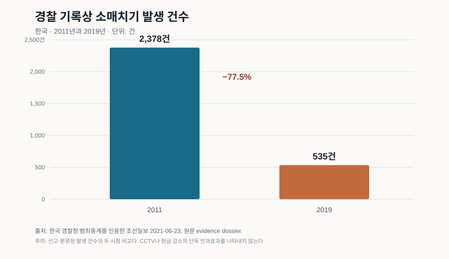
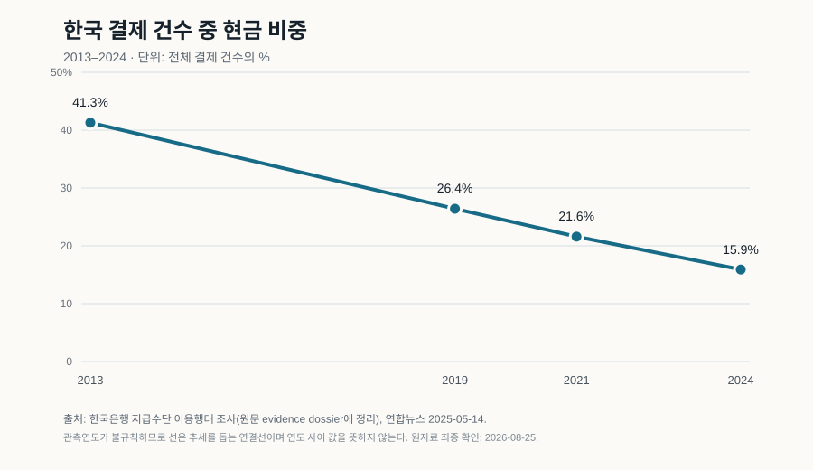

# 지갑을 노리는 사업이 망하는 법

> **근거 상태:** 출처 기반 분석. 한국의 장기 감소 원인은 단일 연구로 식별되지 않았으며, 아래 인과 설명은 여러 자료를 묶은 **복합 메커니즘 가설**이다.

퇴근 시간 지하철. 사람 사이 간격은 손바닥 하나도 되지 않는데 누군가는 가방 지퍼를 열어 둔 채 휴대전화를 본다. 같은 밀도의 관광지에서는 “가방을 앞으로 메라”는 안내가 반복된다. 사람의 선량함이 도시 경계에서 갑자기 바뀌는 것은 아니다. 달라지는 것은 범죄가 돈이 되는 조건이다.

소매치기를 도덕극이 아니라 작은 사업으로 보면 질문이 선명해진다. 무엇을 훔칠 수 있는가. 훔친 물건을 얼마나 빨리 현금화할 수 있는가. 범행과 다음 범행이 연결될 확률은 얼마인가. 잡힌 뒤 사건이 실제 처분까지 이어지는 데 얼마나 많은 마찰이 있는가.

이 글의 중심 가설은 다음과 같다.

> **훔칠 가치가 줄고, 물건과 동선의 추적성이 커지고, 검거가 우연이 아니라 반복 가능한 절차가 되면 소매치기의 기대수익이 무너진다.**

## 두 개의 하강선

한국 경찰 통계를 인용한 보도에서 기록된 소매치기 발생은 2011년 2,378건에서 2019년 535건으로 줄었다. 두 시점만 놓고 계산하면 77.5% 감소다. 이것은 경찰이 분류한 **발생 건수**이지, 인구당 피해율이나 미신고 피해를 포함한 조사값은 아니다.

같은 시기 지갑의 구성도 바뀌었다. 한국은행 지급수단 조사에서 결제 건수 중 현금 비중은 2013년 41.3%에서 2019년 26.4%, 2021년 21.6%, 2024년 15.9%로 내려갔다.

| 관측 | 시작 | 최근/비교 시점 | 이 자료가 말하는 것 | 말하지 못하는 것 |
|---|---:|---:|---|---|
| 경찰 기록 소매치기 발생 | 2,378건(2011) | 535건(2019) | 기록된 사건이 크게 줄었다 | 무엇이 몇 %를 줄였는지 |
| 결제 건수 중 현금 비중 | 41.3%(2013) | 15.9%(2024) | 즉시 쓸 수 있는 익명 현금의 일상 비중이 줄었다 | 현금 감소가 소매치기 감소의 단독 원인인지 |

두 선이 함께 내려갔다는 사실만으로 인과는 성립하지 않는다. 다만 범죄자에게 현금은 카드나 휴대전화와 다른 상품이다. 바로 쓸 수 있고 거래 흔적이 적다. 카드는 정지할 수 있고, 휴대전화와 디지털 기기는 계정·기기 식별자·위치 기록 같은 회수 단서를 남길 수 있다. **훔친 뒤 보유하거나 되파는 비용**이 달라진다.

미국 복지급여를 수표에서 전자카드로 전환한 시차를 이용한 연구는 현금 유통 감소 뒤 전체 범죄와 절도형 범죄가 감소하는 결과를 보고했다. 한국에 대한 직접 추정치는 아니지만 “익명성이 높은 전리품의 공급이 줄면 거리범죄의 수익성이 낮아진다”는 메커니즘에는 독립된 근거를 보탠다.

## 카메라는 원인이 아니라 센서일 수 있다

“CCTV가 소매치기를 없앴다”는 설명은 매끈하지만 자료보다 강하다. 40년에 걸친 CCTV 평가를 모은 2019년 메타분석은 전체 범죄가 평균 약 13% 감소하는 방향을 보고했다. 효과는 적극적인 모니터링과 다른 개입이 결합될 때 더 컸다. 평균 효과는 한국 소매치기의 77.5% 감소와 같지 않다.

카메라 한 대가 하는 일은 영상을 남기는 것이다. 억지력을 만드는 것은 그 뒤의 폐쇄회로다.

**신고 → 영상 확보 → 여러 장소의 동선 연결 → 반복 범행 식별 → 검거·처리**

이 연결이 빠르고 예측 가능할 때 카메라는 “혹시 찍혔을지도 모른다”를 “여러 번 하면 결국 연결된다”로 바꾼다. 범죄 억지 연구를 정리한 미국 국립사법연구소도 처벌의 가혹함보다 **잡힐 확실성**이 더 강한 억지 요인이라고 설명한다.

여기서도 추론의 경계는 분명하다. 서울의 감소에는 현금 축소와 영상 추적 외에도 대중교통 구조, 경찰 수사기법, 인구와 연령, 신고 관행, 절도 시장의 온라인 이동이 함께 작용했을 수 있다. CCTV는 설명의 한 부품이지 승리의 단독 주인공이 아니다.

## 이탈리아라는 강한 반례

이탈리아 관광도시의 소매치기를 “경찰이 일하지 않아서”라고 부르면 실제 관측과 맞지 않는다. 이탈리아 철도경찰은 2025년 역과 열차에서 4만2천 회가 넘는 순찰과 8,526회의 소매치기 전담 활동을 실시했다. Istat의 2024년 소매치기 피해율은 인구 1,000명당 5.1명으로 2014년 6.9보다는 낮았지만 2023년과는 대체로 비슷했다.

이 두 수치는 한국의 발생 건수와 직접 비교할 수 없다. 한쪽은 경찰 기록 건수, 다른 쪽은 피해율이며 관광객 노출도와 조사 정의도 다르다. 이탈리아는 국가 점수표의 패자가 아니라 **단속이 많아도 범죄 사업이 남을 수 있는 조건**을 보여주는 사례다.

관광지는 표적이 계속 교체되고 피해자가 곧 출국한다. 2022년 카르타비아 개혁은 일반 절도 일부를 피해자의 정식 고소가 있어야 진행되는 범주로 넓혔다. 허용되는 사건에서 고소인이 정당한 이유 없이 증인 소환에 불응하면 묵시적 취하로 판단될 수 있는 규칙도 피해자 참여 비용을 키울 수 있다. 이는 법원 적체를 줄이려는 합리적 목표와 충돌한다. 사건 수를 줄이는 제도가 이동성이 큰 피해자를 만날 때, **검거와 최종 처리 사이의 확실성**을 낮출 가능성이 있다는 뜻이다.

반대 방향의 제도 변화도 있다. 이탈리아는 2023년 현행범 체포 절차 일부를 보완했고, 2026년에는 지급수단·신분증·휴대전화 같은 물건을 기술적으로 빼내는 특정 절도에 대한 규정을 손질했다. 제도가 고정돼 있다는 설명보다, 과부하와 억지력 사이에서 계속 조정 중이라는 설명이 더 잘 맞는다.

## 가장 강한 경쟁 설명

한국의 감소가 범죄 억지의 성공이라기보다 **측정과 범죄 이동의 결과**일 수 있다는 반론은 강하다.

- 시민이 소액 피해를 덜 신고했거나 경찰 분류가 바뀌었을 수 있다.
- 현금 절도는 줄었지만 사기·계정 탈취·중고거래 범죄로 수익원이 옮겨갔을 수 있다.
- 인구구조와 상권 변화가 전문 소매치기 집단의 규모를 줄였을 수 있다.
- 휴대전화 보급은 추적성을 높이는 동시에 값비싼 새 표적을 만들었을 수도 있다.

이 설명들은 복합 메커니즘을 폐기하기보다 범위를 좁힌다. 좋은 치안이 “범죄 전체를 없앴다”는 결론은 자료가 지지하지 않는다. 더 제한적인 결론은 **한국에서 기록된 전통적 소매치기의 사업 조건이 여러 방향에서 악화했다**는 것이다.

## 무엇이 이 결론을 바꿀까?

다음 관측이 나오면 현재 가설의 비중을 낮춰야 한다.

- 동일한 신고·분류 기준으로 보정했을 때 한국의 소매치기 감소가 사라진다.
- 현금 보유, 영상 추적성, 검거 확실성 변화가 없어도 비슷한 감소가 반복되며 다른 요인이 더 잘 설명한다.
- 피해자 절차 마찰을 낮춘 지역에서 다른 조건을 통제한 뒤에도 사건 처리율과 재범에 변화가 없다.
- 익명성이 높은 전리품이 다시 늘어도 소매치기 위험이 오르지 않고, 범죄자 인터뷰·사건자료가 다른 병목을 일관되게 가리킨다.

반대로 도시별 패널 자료에서 **현금성 전리품의 감소, 반복범 연결 가능성, 신고에서 처분까지의 시간**이 사건 발생과 재범을 함께 설명한다면 복합 메커니즘은 더 강해진다.

좋은 치안의 결과는 카메라 숫자가 아니다. 훔칠 물건의 가치, 달아날 수 있다는 믿음, 사건이 중간에서 끊길 가능성이 함께 낮아져 범행을 시작할 이유가 사라지는 것이다.

## 출처와 한계

- [원문 한국어 판](../reports/pickpocket-deterrence-2026-08-25/ko.md) 및 [전체 evidence dossier](../reports/pickpocket-deterrence-2026-08-25/sources.md)
- [한국 경찰청 범죄통계](https://www.police.go.kr/user/bbs/BD_selectBbsList.do?estnColumn2=%EB%85%84%EB%8F%84&q_bbsCode=1115), [경찰 통계를 인용한 2021년 보도](https://www.chosun.com/national/national_general/2021/06/23/D4O73XSWJVGVNE7RSMHQG4DOO4/)
- [한국은행 2024년 지급수단 이용행태 조사](https://www.bok.or.kr/portal/bbs/B0000232/view.do?menuNo=200706&nttId=10090464), [현금 비중 시계열 요약](https://www.yna.co.kr/view/AKR20250514126900002)
- [Piza et al., CCTV 40년 메타분석](https://onlinelibrary.wiley.com/doi/full/10.1111/1745-9133.12419), [미 국립사법연구소의 억지 연구 요약](https://nij.ojp.gov/topics/articles/five-things-about-deterrence), [Wright et al., Less Cash, Less Crime](https://www.nber.org/papers/w19996)
- [Istat BES 2024](https://www.istat.it/wp-content/uploads/2025/11/Bes-2024-executive-Summary.pdf), [이탈리아 철도경찰 2025 활동](https://www.interno.gov.it/it/notizie/polizia-ferroviaria-42mila-pattuglie-campo-nel-2025-sicurezza-treni-e-stazioni-0)
- 법률·절차 출처와 일본·싱가포르 비교자료는 evidence dossier에 정리돼 있다. 서로 다른 국가 지표는 순위 계산에 사용하지 않았다.
