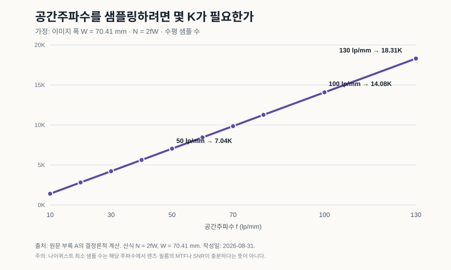

# ‘18K’라는 숫자 밖의 IMAX

> **근거 상태:** 공개 기술문서와 논문, 명시적 가정에 따른 결정론적 계산을 바탕으로 한 기술 해설. “디지털이 이미 15/70과 같다”는 실측 결론이 아니라 **지각적 대체 가능성에 대한 공학적 추론**이다.

15/70 영사실에서는 필름이 가로로 달린다. 거대한 프레임이 렌즈 뒤를 지나고, 관객은 시야를 채우는 화면을 본다. 그 경험을 설명할 때 흔히 “18K급”이라는 숫자가 등장한다. 숫자는 기억하기 쉽다. 문제는 숫자 하나가 렌즈, 필름, 현상, 프린트, 영사기, 스크린, 좌석과 사람의 눈을 모두 대표하지 못한다는 데 있다.

논쟁의 단위를 바꾸면 질문도 달라진다.

> **15/70이 몇 K인가가 아니라, 장면에서 관객의 눈까지 어떤 공간 정보와 대비가 살아남으며 디지털 체인이 그것을 지각 임계치 아래의 오차로 재현할 수 있는가?**

## 필름은 무한하지 않고, K로 고정되지도 않는다

필름에는 정수 픽셀 격자가 없다. 그렇다고 무한한 정보를 저장하는 것도 아니다. 렌즈의 점확산함수, 유제의 산란, 감광 입자와 염료 구조, 광자 잡음, 현상 조건이 공간주파수별 대비를 제한한다.

이때 유용한 언어가 MTF(Modulation Transfer Function)다. 굵은 줄무늬의 밝고 어두운 차이가 원본의 100%라면, 촬영과 현상을 거친 뒤 그 차이가 얼마나 남는지 주파수별로 본다. 주파수가 높아질수록 대비는 서서히 사라지고, 어느 순간 필름 입자성에 의한 잡음과 구분하기 어려워진다.

그래서 “해상도는 몇 K인가?”보다 다음 질문이 정확하다.

- 20, 50, 100 lp/mm에서 렌즈와 필름이 남기는 대비는 얼마인가?
- 그 대비가 grain과 다른 잡음보다 충분히 큰가?
- 프린트와 영사에서 얼마나 더 손실되는가?
- 관객의 좌석에서 그 차이가 보이는가?

요약하면 비교 단위는 **MTF × SNR × viewing condition**이다.

## 18K는 조건을 숨긴 환산값이다

15/70 이미지 폭을 계산용 가정으로 70.41 mm라고 두고, 공간주파수 (f)를 나이퀴스트 조건으로 샘플링하는 최소 수평 샘플 수 (N)을 계산하면 다음과 같다.

\[
N = 2fW
\]

| 공간주파수 | 최소 수평 샘플 수 | 흔한 K 표기로 줄이면 |
|---:|---:|---:|
| 50 lp/mm | 7,041 | 약 7.0K |
| 80 lp/mm | 11,266 | 약 11.3K |
| 100 lp/mm | 14,082 | 약 14.1K |
| 130 lp/mm | 18,307 | 약 18.3K |

18K라는 말은 약 130 lp/mm까지 샘플링하겠다는 특정 가정과 대응할 수 있다. 그러나 그 주파수에서 실제 장면 대비가 남는지, grain보다 신호가 큰지는 말해 주지 않는다. 표는 필름의 “진짜 해상도”가 아니라 **하나의 공간주파수를 디지털 격자에 옮기는 최소 관계**다. 색필터 배열, 디모자이킹, 샘플링 개구와 안티앨리어싱을 고려하면 실제 설계에는 여유가 필요하다.

## 2026년의 부품들은 무엇을 증명했나

공개된 제품과 시연은 서로 다른 문제를 풀었다. 아직 한 시스템으로 묶였다는 뜻은 아니다.

| 기술 | 공개 사양 | 확인되는 범위 | 확인되지 않는 것 |
|---|---|---|---|
| Blackmagic URSA Cine 17K 65 | 50.81 × 23.32 mm, 17,520 × 8,040, 2.9 μm, 16 stops, 17K 최대 60 fps | 1억 화소가 넘는 시네마 센서의 고속 촬영과 워크플로 | 15/70과 같은 약 70 × 50 mm 면적, 지각적 동등성 |
| Canon 410 MP CMOS | 35 mm 풀프레임, 24,592 × 16,704 | 수억 화소급 고밀도 집적 | 시네마용 동적범위·프레임률·색 재현 |
| Lasergraphics Director | IMAX/65/70 mm 지원, 최대 13.5K, 순차 RGB, HDR 스캔 | 대형 필름의 고해상도 디지털 취득 | 원본의 모든 미시 정보 보존 |
| Samsung Onyx 2026 | 14 m 모델, 최대 4K/120 Hz, 3.3 mm pitch, 최대 300 nit; 20 m 확장 | 대형 직접발광 극장의 상용화 | 12K 종단 체인과 전 세계 극장 경제성 |

이 표가 지지하는 결론은 제한적이다. 고픽셀 캡처, 대형면적, 필름 스캔, 직접발광 상영이라는 **개별 서브문제는 현실의 기술**이다. 여기서 바로 “디지털이 IMAX를 끝냈다”고 뛰어넘으면 센서 수율, 열, 읽기 속도, VFX, 배급, 상영 균일도와 음향을 지운다.

## 관객의 좌석이 K를 바꾼다

스크린 수평 해상도를 (N), 관객에게 보이는 수평 시야각을 \(\theta\)라 하면 단순 평균 pixels per degree는 다음처럼 계산할 수 있다.

\[
PPD \approx N / \theta
\]

2025년 *Nature Communications* 연구는 중심와 무채색 조건에서 약 94 ppd에 이르는 분해능을 보고했다. 이것은 모든 관객과 모든 색·밝기·주변시 조건의 상수가 아니다. 다만 “60 ppd면 언제나 충분하다”는 관행적 상한을 경계하게 한다.

| 수평 시야각 | 94 ppd에 필요한 수평 샘플 | 120 ppd 가정 |
|---:|---:|---:|
| 60° | 5.6K | 7.2K |
| 80° | 7.5K | 9.6K |
| 100° | 9.4K | 12.0K |
| 110° | 10.3K | 13.2K |

같은 8K도 뒤 좌석에서는 충분할 수 있고, 100°에 가까운 앞 좌석과 시력이 좋은 관객에게는 차이가 남을 수 있다. 영화 관객은 화면 곳곳으로 눈을 움직이므로 주변시의 낮은 분해능만으로 화면 가장자리를 무시할 수도 없다. “몇 K면 끝인가?”의 답은 스크린 폭이 아니라 **시야각, 대비, 밝기, 움직임, 개인 시력**에 달려 있다.

## 필름의 느낌은 취향이기 전에 전달함수다

필름과 디지털이 다르게 보인다는 경험을 미신으로 치부할 이유는 없다. 필름의 toe와 shoulder, 하이라이트 압축, halation, 색층의 분광응답, grain의 공간·시간 통계, 프린트와 영사의 flare는 측정 가능한 특성이다.

하지만 “다르다”와 “더 낫다”는 별개다. 판별은 감각 실험의 문제이고, 선호는 취향의 문제다. 매우 깊은 검정을 내는 직접발광 화면에서 필름 스캔을 재생하면 전통 영사보다 오히려 대비가 높아져 덜 필름처럼 보일 수도 있다. 원본 체인을 닮게 하려면 더 좋은 디스플레이에서 영사 flare와 black floor를 의도적으로 모델링해야 할 수 있다.

공학적 병목은 해상도만이 아니다.

- 큰 센서의 수율, full-well capacity, 열과 읽기 속도
- 12K급 촬영 원본을 편집·VFX·색보정·보관하는 비용
- 대형 LED 모듈의 색·휘도 균일도, 수명과 전력
- 불투명 LED 벽에서 스크린 뒤 스피커를 대체할 음향 설계
- 콘텐츠 제작, 마스터링, 배급, 극장 QA를 묶는 표준과 사업성

24 fps, 14.1K급 1.43:1 프레임을 16-bit 단일 RAW sample로 단순 계산하면 약 6.66 GB/s, 시간당 약 24 TB다. 물리적으로 불가능한 수치라기보다 복제, VFX, 네트워크와 보관 비용이 누적되는 워크플로 문제다.

## 가장 강한 반론: 샘플링 가능성이 경험의 대체를 보장하지 않는다

디지털 지지 논리의 약점은 “부품 사양이 존재한다”에서 “관객 경험을 복제할 수 있다”로 건너뛰기 쉽다는 점이다.

15/70 경험에는 촬영 네거티브의 면적뿐 아니라 렌즈 선택, 실제 필름 프린트, 영사 안정성, 화면의 크기와 밝기, 극장 지오메트리, 음향, 희소한 상영 이벤트라는 문화적 맥락이 함께 들어간다. 디지털 체인이 공간정보를 초과 샘플링해도 grain의 시간적 변화나 색·하이라이트 반응을 잘못 모델링하면 훈련된 관객이 구별할 수 있다. 기술적으로 가능한 시스템이 극장주가 설치할 수 있는 가격이라는 보장도 없다.

이 반론은 “필름은 원리적으로 복제 불가능하다”를 증명하지 않는다. 대신 대체의 정의를 **픽셀 수가 아니라 종단 간 판별불가능성과 경제성**으로 엄격하게 만든다.

## 무엇이 이 결론을 바꿀까?

결정적 실험은 같은 장면과 좌석 조건에서 두 경로를 이중맹검으로 비교하는 것이다.

- A: 동일 15/70 네거티브 → 광화학 프린트 → 보정된 15/70 영사
- B: 동일 네거티브 → 고해상도·고비트 스캔 → 보정된 디지털 마스터 → 고해상도 직접발광 또는 동급 상영

2AFC나 ABX로 **어느 쪽인지 판별하는 능력**과 **어느 쪽을 선호하는지**를 분리한다. 좌석, 시야각, 시력, 일반 관객과 훈련된 촬영·색보정 전문가를 층화하고, 사전등록한 등가성 한계로 분석해야 한다. 단순히 유의하지 않았다는 결과만으로 “같다”고 선언해서는 안 된다.

충분한 공간 샘플링, 동적범위, 색 보정, film-transfer 모델을 적용해도 여러 장면과 좌석에서 관객이 일관되게 필름 경로를 판별하고 그 차이가 아직 모델링되지 않은 물리 변수에 연결된다면 지각적 대체 가능성 가설은 약해진다. 반대로 차이가 등가성 한계 안에 반복적으로 머문다면 “필름은 디지털로 원리적으로 복제할 수 없다”는 주장이 약해진다.

18K는 멋진 표지판이다. 그러나 목적지는 아니다. 목적지는 관객이 실제로 받는 정보와 경험을 측정하고, 필요한 만큼만 보존하는 종단 간 시스템이다.

## 출처와 계산 조건

- [원문 기술 연구](../papers/imax-digital-equivalence.ko.md). 원문의 학문적 권위를 암시하는 자기규정은 이 매거진 판의 근거나 수식어로 사용하지 않았다.
- [Kodak VISION3 50D 기술문서](https://www.kodak.com/content/pdfs/motion/KODAK-VISION3-50D-5203-7203-technical-information.pdf), [ZEISS MTF 안내](https://lenspire.zeiss.com/photo/app/uploads/2018/04/Article-MTF-2008-EN.pdf)
- [Blackmagic URSA Cine 17K 65 사양](https://www.blackmagicdesign.com/kr/products/blackmagicursacine/techspecs), [ARRI ALEXA 265 발표](https://www.arri.com/en/company/press/press-releases-2024/arri-announces-the-small-and-lightweight-alexa-265-camera-revolutionizing-65-mm-cinematography), [Canon 410 MP CMOS](https://global.canon/en/news/2025/20250122.html)
- [Lasergraphics Director](https://lasergraphics.com/director.html), [DCI 규격](https://www.dcimovies.com/dci-specification/), [Samsung Onyx 2026](https://news.samsung.com/global/samsung-introduces-14-meter-onyx-cinema-led-display-at-cinemacon-2026)
- Ashraf, Chapiro & Mantiuk, [Resolution limit of the eye](https://doi.org/10.1038/s41467-025-64679-2), *Nature Communications* 16, 9086 (2025).
- 차트와 표의 샘플 수는 (W=70.41\,mm\), (N=2fW)라는 원문 가정으로 다시 계산했다. 특정 카메라·프린트 aperture의 보편적 실측값으로 취급하지 않는다.
