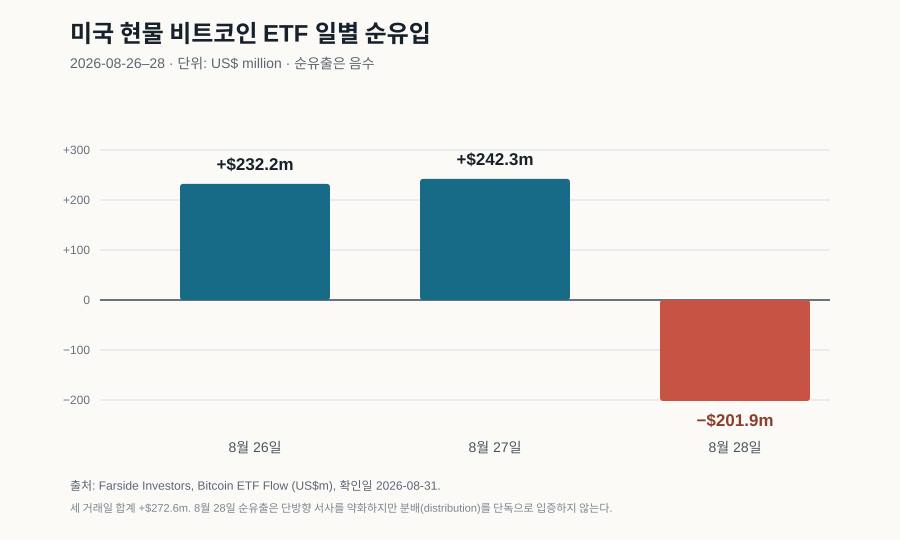

# 8만 달러의 환승역

> **근거 상태:** 2026년 8월 31일까지 공개된 가격 보도와 미국 현물 ETF 흐름을 반영한 시점 명시 시장 분석. `exit liquidity`는 확인된 시장 상태의 이름이 아니라 **검증 중인 수급 가설**이다. 투자 권유가 아니다.

8월 25일 아시아 장에서 비트코인은 8만 달러를 넘었다. 화면에는 석 달여 만의 최고가가 떴다. Reuters 보도에 따르면 장중 81,237.94달러를 찍고 80,323.24달러 부근에 있었으며, 8월 들어 상승률은 약 28%였다.

강한 숫자는 이야기를 단순하게 만든다. “강세장이 돌아왔다.” 그러나 사흘 뒤 다른 숫자가 켜졌다. 미국 현물 비트코인 ETF는 8월 26일과 27일 각각 2억3,220만 달러, 2억4,230만 달러 순유입을 기록한 뒤 28일 2억190만 달러 순유출로 돌아섰다.

| 날짜 | 관측 | 해석 가능한 범위 |
|---|---:|---|
| 2026-08-25 | BTC 장중 $81,237.94, 보도 시점 $80,323.24; 8월 상승률 약 28% | 랠리의 크기와 가격 위치 |
| 2026-08-26 | 현물 BTC ETF +$232.2m | 해당 거래일의 순유입 |
| 2026-08-27 | 현물 BTC ETF +$242.3m | 순유입 지속 |
| 2026-08-28 | 현물 BTC ETF −$201.9m | 흐름이 단방향이 아님 |
| 8/26–28 합계 | +$272.6m | 사흘 합계는 여전히 순유입 |

28일의 빨간 막대는 “분배가 확인됐다”는 증거가 아니다. 하루 순유출은 리밸런싱, 차익실현, 거시 뉴스, 펀드별 흐름으로도 생긴다. 다만 돈이 매일 같은 방향으로 들어온다는 낙관적 서사에는 실제 반례다.

## 가격보다 매수의 수명을 보자

가격을 밀어 올리는 주문은 겉으로 같아도 수명이 다르다.

- 현물 ETF로 들어오는 자금은 다음 날에도 반복될 수 있다.
- 거시 환경이나 규제 기대에 따른 포트폴리오 편입도 지속될 수 있다.
- 숏 포지션의 강제청산은 가격이 급등할 때 자동 매수를 만들지만, 청산된 포지션은 같은 방식으로 다시 살 수 없다.
- 과거 매수자의 본전 매도와 단기 차익실현은 상승할수록 공급을 늘릴 수 있다.

2026년 8월 22일 원문이 정리한 보도에서는 이틀 동안 암호자산 숏 포지션 40억 달러 이상이 청산됐다고 전했다. 이 수치는 비트코인 현물 매수만을 뜻하지 않고 암호자산 파생시장 전반의 명목 청산 규모다. 그럼에도 메커니즘은 중요하다. 가격 상승이 강제 매수를 부르고, 강제 매수가 다시 가격을 올리는 동안 차트는 기본 수요보다 더 빠르게 움직일 수 있다.

이 글의 가설을 물통으로 줄이면 이렇다.

> **지속 가능한 새 현물 수요 + 일회성 강제매수 − 기존 보유자의 매도 − 차익실현**

정확한 가격결정식은 아니다. 어떤 매수가 내일도 남아 있고 어떤 매수가 이미 소진됐는지 묻는 점검표다.

## “출구 유동성”은 비난이 아니라 상대방의 문제다

모든 거래에는 매수자와 매도자가 있다. 누군가 이익을 실현한다고 해서 새 매수자가 자동으로 피해자가 되는 것은 아니다. 새 매수자는 더 긴 시간축, 다른 위험 선호, 비트코인의 공급 규칙·전송성·자기보관·검열 저항에 대한 다른 평가를 가질 수 있다.

문제는 가격이 급등한 뒤 **반복 가능한 새 수요가 오래된 매도 의사를 흡수할 수 있는가**다. 원문은 Glassnode 자료를 인용한 보도를 바탕으로 7만8천~8만2천 달러 부근을 과거 취득원가가 몰린 구간으로 다뤘다. 취득원가가 그 가격이라는 사실은 매도 의사를 뜻하지 않는다. 그러나 손실을 버티다 본전 부근에서 매도하는 처분효과는 비트코인 투자자 행동 연구에서도 관측된 바 있다.

Schatzmann과 Haslhofer는 블록체인과 거래소 이동 자료에서 비트코인 투자자의 처분효과를 분석했다. Kogan, Makarov, Niessner, Schoar는 20만 개 eToro 계좌를 분석해 같은 개인들이 전통자산보다 암호자산에서 가격을 추종하는 경향이 강하다고 보고했다.

두 행동이 동시에 나타나면 시장은 환승역이 된다.

**오래 보유한 사람:** 손실이 줄었으니 일부를 판다.  
**새로 들어온 사람:** 강한 상승을 새로운 정보로 보고 산다.

이 교대가 가격을 멈추게 할 수도 있고, 새 수요가 더 크면 매물을 소화한 뒤 다시 오를 수도 있다. 거래량만으로 어느 쪽인지 알 수 없다.

## 현금흐름이 없다는 말의 한계

비트코인은 채권의 이자나 기업의 배당처럼 보유자에게 약정된 현금흐름을 지급하지 않는다. 그래서 가격에서 미래 재판매 가치가 차지하는 비중이 크다는 비판은 타당하다.

가장 강한 반론은 금, 미술품, 통화처럼 계약상 현금흐름이 없는 자산도 **희소성, 유동성, 보관·전송 기능, 네트워크 효과**에 대한 지속적인 수요로 가치를 유지할 수 있다는 것이다. 비트코인 네트워크가 제공하는 결제·정산·자기보관 특성을 모두 “다음 바보 찾기”로 줄이면 실제 사용과 제도화를 설명하지 못한다. 미국 현물 ETF의 존재도 접근 비용과 보관 마찰을 낮춰 수요 기반을 바꿀 수 있다.

따라서 더 방어적인 문장은 이렇다.

> **비트코인은 약정 현금흐름이 없어 가격이 기대와 유동성에 민감하지만, 그것만으로 모든 상승을 출구 유동성이라고 판정할 수는 없다.**

## 8월 랠리를 지지하는 설명

강세장 설명도 충분히 강하다.

- Reuters가 보도한 8월 25일 기준 월간 상승률은 약 28%였고, 8만 달러를 회복했다.
- 8월 26~28일 ETF 흐름은 마지막 날 순유출에도 사흘 합계 2억7,260만 달러 순유입이었다.
- 규제 명확성에 대한 기대와 기관 접근성 확대는 과거보다 넓은 구매자 기반을 만들 수 있다.
- 미국 달러 약세와 화폐가치 희석 우려가 금과 비트코인 같은 비국가 자산 수요를 함께 자극할 수 있다.

이 설명에서 숏 청산은 시작을 증폭했을 뿐이고, 이후 현물 수요가 추세를 이어받는다. 8월 28일의 순유출은 상승 과정의 하루 변동이지 구조적 반전이 아니다.

반대편 설명도 가능하다. 거시 뉴스가 만든 급등과 강제청산이 먼저 가격을 올렸고, 8만 달러 부근에서 오래된 보유자가 매도하면서 신규 자금이 가격 상승보다 재고 흡수에 쓰일 수 있다. 28일 순유출은 그 취약성이 드러난 첫 관측일 수 있지만, 단독 증거는 아니다.

현재 데이터는 둘 중 하나를 판결하지 않는다. 그래서 “새 강세장”이나 “분배”라는 이름보다 **흡수 시험**이라는 표현이 유용하다.

## 네 개의 계기판

| 계기판 | 강세장 가설이 강해지는 관측 | 출구 유동성 가설이 강해지는 관측 |
|---|---|---|
| 현물 ETF 흐름 | 여러 주에 걸친 폭넓은 순유입 | 유입 둔화·지속 순유출 |
| 가격대 수용 | $78k–$82k 위에서 거래량을 동반해 안정 | 큰 거래량에도 같은 구간에서 반복 거절 |
| 강제청산 이후 | 숏 청산이 줄어도 상승·현물 거래 유지 | 부스터가 사라진 뒤 가격 약화 |
| 오래된 보유 물량 | 실현매도가 늘어도 가격이 흡수 | 거래소 유입과 매도 증가에 가격이 민감하게 하락 |

각 지표에는 잡음이 있다. ETF는 전체 시장이 아니고, 온체인 취득원가는 실제 개인별 원가와 다르며, 거래소 이동이 반드시 매도를 뜻하지 않는다. 따라서 하루 수치나 한 지표로 판정하지 않고 **기간과 조합**을 봐야 한다.

## 무엇이 이 결론을 바꿀까?

현재 결론은 “8월 랠리가 신규 수요의 지속성을 시험 중이며 판결은 열려 있다”는 것이다.

다음 관측이 이어지면 출구 유동성 가설은 약해진다.

- 숏 청산 규모가 정상화된 뒤에도 현물 거래와 ETF 순유입이 여러 주 지속된다.
- 7만8천~8만2천 달러 구간을 돌파한 뒤 그 위에서 가격과 유동성이 안정된다.
- 장기 보유자의 실현매도가 늘어도 시장이 큰 가격 충격 없이 흡수한다.

반대로 ETF가 지속 순유출로 바뀌고, 높은 거래량에도 해당 가격대를 넘지 못하며, 강제청산 효과가 끝난 뒤 오래된 물량의 거래소 유입과 가격 약화가 함께 나타나면 “신규 자금이 기존 보유자의 출구를 제공한다”는 설명이 강해진다.

8월 28일은 결론이 아니라 경고등 하나다. 시장의 방향은 가장 큰 헤드라인보다 **누가 자발적으로 사고, 그 돈이 얼마나 오래 머무르며, 팔려는 재고를 얼마나 흡수하는가**가 결정한다.

## 출처와 한계

- [2026-08-22 원문 분석과 전체 참고문헌](../reports/crypto-exit-liquidity-2026-08-22.md)
- Reuters, [Bitcoin rises above $80,000 as soft dollar, debasement fears boost momentum](https://www.investing.com/news/economy-news/bitcoin-rises-above-80000-as-soft-dollar-debasement-fears-boost-momentum-4874482), 2026-08-25. Reuters 기사의 재게시본으로 가격과 월간 상승률을 확인했다.
- [Farside Investors — Bitcoin ETF Flow (US$m)](https://farside.co.uk/btc/), 2026-08-26~28 수치, 2026-08-31 확인.
- Schatzmann & Haslhofer, [Exploring investor behavior in Bitcoin: a study of the disposition effect](https://doi.org/10.1007/s42521-023-00086-w), *Digital Finance* 5 (2023).
- Kogan et al., [Are cryptos different? Evidence from retail trading](https://doi.org/10.1016/j.jfineco.2024.103897), *Journal of Financial Economics* 159 (2024).
- 청산 규모와 온체인 공급 구간은 원문이 인용한 CoinDesk/CoinGlass/Glassnode 보도에 의존한다. 명목 청산액, 현물 유입, 실제 매도량을 같은 단위의 인과효과로 취급하지 않았다.
